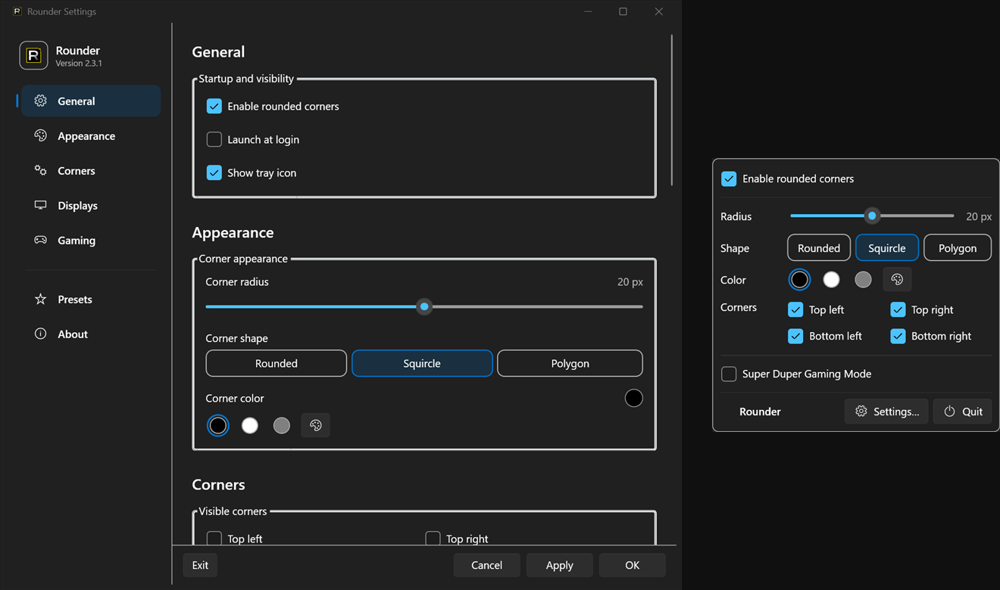
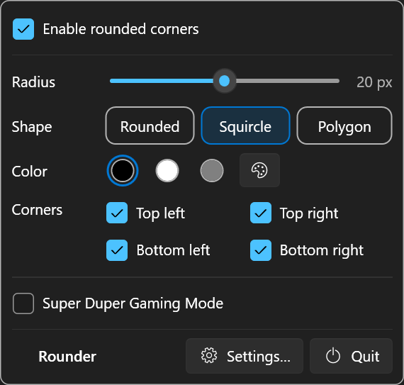
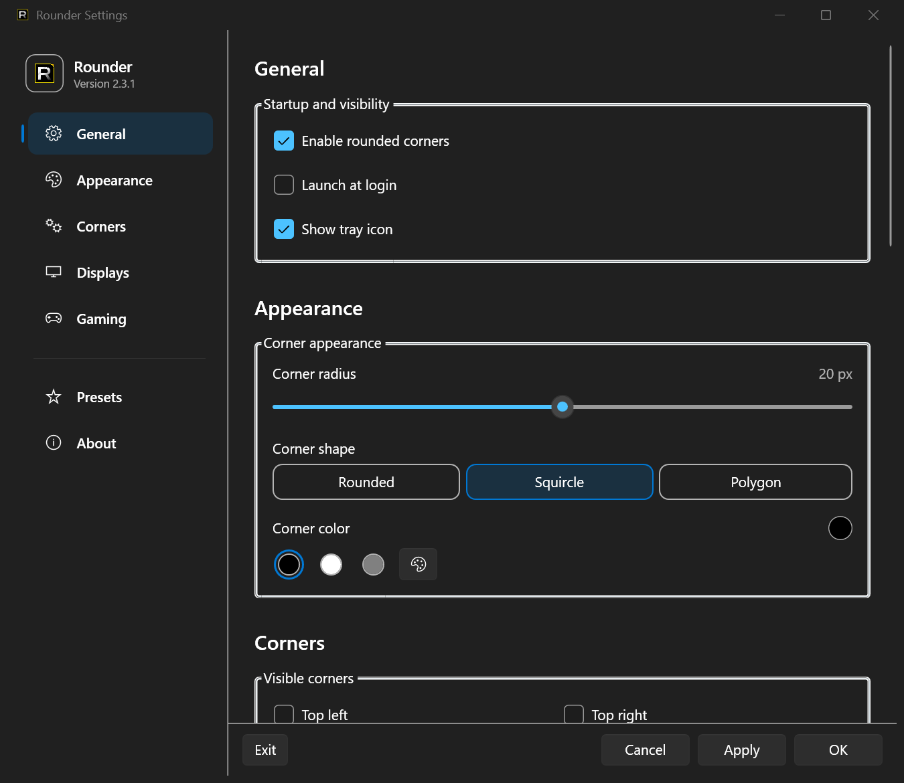

#  Rounder for Windows

A native Windows utility that gives square display corners a natural rounded look.

[](https://github.com/nisesimadao/Rounder_Windows/releases/latest)
[](https://github.com/nisesimadao/Rounder_Windows/actions/workflows/release.yml)
[](#requirements)

<p align="center">
  
</p>

Rounder places tiny click-through overlays at the corners of selected displays, so the screen appears naturally rounded without modifying Windows itself. It normally lives in the notification area, and it can keep running in the background even when its tray icon is hidden. **No screen recording, accessibility permission, administrator access, or network connection is required.**

[日本語 README](./README_jp.md)

## Highlights

- **Three corner shapes** — Rounded / Squircle / Polygon
- **0–40 px radius** — live adjustment from the tray menu
- **Any corner color** — with black / white / gray quick color buttons
- **Per-corner visibility** — independently toggle all four corners
- **Multi-display support** — choose exactly which displays receive overlays
- **Presets** — save, edit, and apply reusable presets
- **Super Duper Gaming Mode** — animated rainbow edge glow with speed, intensity, and bloom controls
- **Launch at login** — using the current user's Windows Run entry
- **Show / hide tray icon** — Rounder keeps running when the icon is hidden
- **Per-monitor DPI support** — stays aligned across mixed-scale monitor setups
- **No elevated privileges** — runs as a normal local overlay utility

## Tray controls

When the tray icon is visible, the common controls are available without opening Settings: enable / disable Rounder, radius, shape, quick colors, individual corners, Super Duper Gaming Mode, Settings, and Quit.

Radius, shape, color, corner visibility, and Gaming Mode changes made from the tray are applied immediately. If the tray icon is hidden, launch `Rounder_Windows.exe` again to open the Settings window of the already-running process. A second Rounder instance is not created.

<p align="center">
  
</p>

## Download & install

Download the latest build from [Releases](https://github.com/nisesimadao/Rounder_Windows/releases/latest).

- **`Rounder_Windows_Setup.exe`** — recommended installer build.
- **`Rounder_Windows.exe`** — self-contained single-file build that can be run directly.

Release builds are self-contained, so installing a separate .NET Runtime is not required.

The current releases are not code-signed, so Windows SmartScreen may warn on first launch. Verify that the file came from this repository's GitHub Releases page before running it.

## First launch

A normal launch opens Settings. Launch-at-login starts Rounder silently in the background without opening Settings.

If the tray icon is hidden, Rounder continues running. Launch `Rounder_Windows.exe` again whenever you want to reopen Settings; doing so does not change the saved tray-icon preference.

## Settings

The Settings window follows the same structure as the macOS Rounder app where the Windows platform allows it.

- **General** — enable Rounder, launch at login, tray icon visibility
- **Appearance** — radius, Rounded / Squircle / Polygon, color
- **Corners** — independent corner toggles
- **Displays** — target-display selection, including selecting none
- **Gaming** — rainbow glow, speed, intensity, bloom width
- **Presets** — save, apply, edit, and delete
- **About** — version, technology, and GitHub link

<p align="center">
  
</p>

## Requirements

- Windows 10 or Windows 11
- x64 PC
- Release builds: no extra runtime required
- Building from source: .NET 9 SDK

## Privacy & permissions

Rounder for Windows does not request screen recording, accessibility, location, microphone, camera, or network permissions. Settings and presets are stored as JSON under `%AppData%\Rounder`.

When **Launch at login** is enabled, Rounder creates a startup value under `HKCU\Software\Microsoft\Windows\CurrentVersion\Run`.

See [Privacy](./docs/PRIVACY.md) and [Security](./docs/SECURITY.md) for details.

## Technical notes

- .NET 9 / `net9.0-windows`
- WPF Settings, tray quick controls, preset editor, and prompt dialogs using the built-in .NET 9 Fluent theme
- WinForms `ApplicationContext` / `NotifyIcon` only for app lifetime and notification-area integration
- click-through, topmost, per-pixel-alpha layered windows
- GDI+ Rounded / Squircle / Polygon rendering
- PerMonitorV2 DPI awareness
- display topology monitoring with `SystemEvents.DisplaySettingsChanged`
- single-instance activation so launching Rounder again reopens Settings

## Build from source

```powershell
dotnet build .\Rounder_Windows.csproj -c Release
```

Self-contained single-file build:

```powershell
dotnet publish .\Rounder_Windows.csproj `
  -c Release `
  -r win-x64 `
  --self-contained true `
  -p:PublishSingleFile=true `
  -p:EnableCompressionInSingleFile=true `
  -p:IncludeNativeLibrariesForSelfExtract=true `
  -p:DebugType=None `
  -p:DebugSymbols=false `
  -o .\artifacts\release\Rounder_Windows-win-x64-singlefile
```

## Releases / CI

Pushes to `main` or `master` are built on a Windows runner. If a `v<Version>` release matching the project `<Version>` does not exist yet, the workflow creates it automatically.

Each release contains:

- `Rounder_Windows.exe`
- `Rounder_Windows-win-x64-singlefile.zip`
- `Rounder_Windows_Setup.exe`

## Project docs

- [Changelog](./docs/CHANGELOG.md)
- [FAQ 日本語](./docs/FAQ.ja.md)
- [FAQ English](./docs/FAQ.md)
- [Privacy](./docs/PRIVACY.md)
- [Security](./docs/SECURITY.md)
- [Contributing](./docs/CONTRIBUTING.md)
- [License](./LICENSE)

## Troubleshooting

**The rounded corners are not visible.**
Check that Rounder is enabled and that at least one target display is selected under Displays. Selecting no displays intentionally disables overlays everywhere.

**A Settings change did not apply.**
Use **Apply** or **OK** in Settings. Tray-menu changes to radius, shape, color, corner visibility, and Gaming Mode are applied immediately.

**I hid the tray icon and want it back.**
Launch `Rounder_Windows.exe` again, enable **Show tray icon** in Settings, then Apply.

**The overlay is hidden by a fullscreen app.**
Rounder reasserts topmost z-order for normal desktop and borderless-fullscreen use, but secure desktops, the lock screen, and some exclusive-fullscreen applications can still appear above normal application windows.
