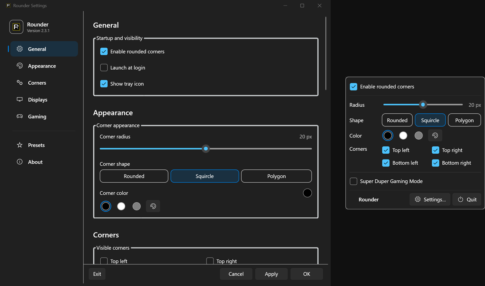
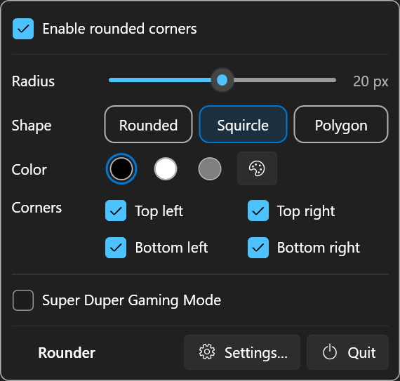
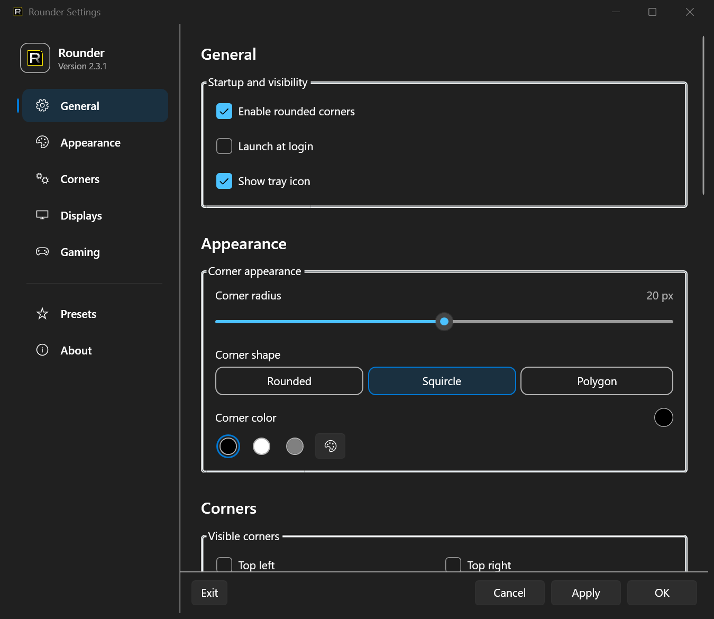

#  Rounder for Windows

Rounder for Windows は、Windows 10 / 11 の画面四隅にオーバーレイを描画し、直線的なディスプレイの角を丸く見せるユーティリティです。

[](https://github.com/nisesimadao/Rounder_Windows/releases/latest)
[](https://github.com/nisesimadao/Rounder_Windows/actions/workflows/release.yml)
[](#システム要件)

<p align="center">
  
</p>

角が直線的な外部モニターなどに、小さなクリック透過オーバーレイを重ねます。
Windows 自体は変更しません。
通常は通知領域から操作し、必要であればトレイアイコンを隠したままバックグラウンドで動作させられます。
画面収録、アクセシビリティ、管理者権限、ネットワーク接続は必要ありません。

[English README](./README.md)

## 主な機能

- **3 種類の角形状**：Rounded / Squircle / Polygon。
- **0〜40 px の角半径**：トレイパネルから変更できます。
- **任意の角色**：カラーピッカーに加え、黒 / 白 / グレーの選択肢を用意しています。
- **四隅の個別切り替え**：各コーナーを個別に表示または非表示にできます。
- **マルチディスプレイ対応**：Rounder を適用する画面を選択できます。
- **プリセット**：設定を保存、編集、適用できます。
- **Super Duper Gaming Mode**：レインボー発光の速度、強度、Bloom 幅を変更できます。
- **ログイン時の起動**：Windows のユーザー別 Run エントリを使用します。
- **トレイアイコンの表示切り替え**：アイコンを隠しても Rounder はバックグラウンドで動作を続けます。
- **Per-Monitor DPI 対応**：拡大率が異なる複数モニターでも、各画面の角に合わせて配置します。
- **追加権限を使わない構成**：通常ユーザー権限のローカルオーバーレイとして動作します。

## トレイからの操作

トレイアイコンを表示している場合は、設定画面を開かずに主要な項目を変更できます。
Rounder の有効 / 無効、角半径、形状、クイック色、四隅、Super Duper Gaming Mode、設定、終了をまとめています。

半径や形状を変更すると、既存のオーバーレイへその場で反映します。
トレイアイコンを非表示にしていても、`Rounder_Windows.exe` を再度起動すると既存プロセスの設定画面を開きます。
二重起動はしません。

<p align="center">
  
</p>

## ダウンロードとインストール

[Releases](https://github.com/nisesimadao/Rounder_Windows/releases/latest) から、次のいずれかをダウンロードできます。

- **`Rounder_Windows_Setup.exe`**：インストーラー版です。
  通常はこちらを使用します。
- **`Rounder_Windows.exe`**：self-contained の単一ファイル版です。
  インストールせずに実行できます。

Release 版には .NET Runtime を含むため、別途 .NET をインストールする必要はありません。

現在の Release はコード署名していません。
そのため、初回起動時に Windows SmartScreen が警告を表示する場合があります。
GitHub Releases から取得したファイルであることを確認してから実行してください。

## 初回起動

通常起動では設定画面を開きます。
ログイン時の自動起動では設定画面を表示せず、バックグラウンドで起動します。

トレイアイコンを隠していても Rounder 自体は動作を続けます。
設定を再度開く場合は `Rounder_Windows.exe` を起動してください。
保存済みの「トレイアイコンを表示」設定は変更しません。

## 設定

設定画面の構成は macOS 版 Rounder と揃えています。

- **General**：Rounder の有効化、ログイン時起動、トレイアイコン表示。
- **Appearance**：半径、Rounded / Squircle / Polygon、色。
- **Corners**：四隅の個別オン / オフ。
- **Displays**：対象モニターの選択。
  すべて無効にすることもできます。
- **Gaming**：レインボー発光、速度、強度、Bloom 幅。
- **Presets**：保存、適用、編集、削除。
- **About**：バージョン、技術情報、GitHub リンク。

<p align="center">
  
</p>

## システム要件

- Windows 10 または Windows 11。
- x64 PC。
- Release 版は追加ランタイム不要。
- ソースからビルドする場合は .NET 9 SDK。

## プライバシーと権限

Rounder for Windows は、画面収録、アクセシビリティ、位置情報、マイク、カメラ、ネットワークの権限を要求しません。
設定とプリセットは `%AppData%\Rounder` に JSON として保存します。

「ログイン時に起動」を有効にした場合だけ、`HKCU\Software\Microsoft\Windows\CurrentVersion\Run` に Rounder の起動エントリを作成します。

詳しくは [Privacy](./docs/PRIVACY.md) と [Security](./docs/SECURITY.md) を参照してください。

## 技術メモ

- .NET 9 / `net9.0-windows`。
- .NET 9 標準 Fluent Theme を使った WPF の設定画面、トレイ操作、プリセット編集、入力ダイアログ。
- WinForms `ApplicationContext` / `NotifyIcon` は常駐処理と通知領域連携だけに使用します。
- クリック透過、topmost、per-pixel alpha の layered window。
- GDI+ による Rounded / Squircle / Polygon 描画。
- PerMonitorV2 DPI awareness。
- `SystemEvents.DisplaySettingsChanged` でディスプレイ構成変更を検知します。
- 単一インスタンスとして動作し、再起動要求では既存の設定画面を前面へ表示します。

## ソースからビルド

```powershell
dotnet build .\Rounder_Windows.csproj -c Release
```

self-contained の単一 EXE を作る場合は、次のコマンドを使用します。

```powershell
dotnet publish .\Rounder_Windows.csproj `
  -c Release `
  -r win-x64 `
  --self-contained true `
  -p:PublishSingleFile=true `
  -p:EnableCompressionInSingleFile=true `
  -p:IncludeNativeLibrariesForSelfExtract=true `
  -p:DebugType=None `
  -p:DebugSymbols=false `
  -o .\artifacts\release\Rounder_Windows-win-x64-singlefile
```

## リリースと CI

`main` / `master` への push で Windows runner がビルドと配布物を検証します。
`.csproj` の `<Version>` に対応する `v<Version>` Release が存在しない場合は、GitHub Release を自動で作成します。

Release には次のファイルを添付します。

- `Rounder_Windows.exe`
- `Rounder_Windows-win-x64-singlefile.zip`
- `Rounder_Windows_Setup.exe`

## プロジェクト文書

- [Changelog](./docs/CHANGELOG.md)
- [FAQ 日本語](./docs/FAQ.ja.md)
- [FAQ English](./docs/FAQ.md)
- [Privacy](./docs/PRIVACY.md)
- [Security](./docs/SECURITY.md)
- [Contributing](./docs/CONTRIBUTING.md)
- [License](./LICENSE)

## トラブルシューティング

**角丸が表示されない**  
Rounder が有効になっているか、Displays で対象モニターが選択されているか確認してください。
すべてのモニターを無効にすると、オーバーレイは表示されません。

**変更が反映されない**  
設定画面では **Apply** または **OK** を押してください。
トレイパネルから変更する半径、形状、色、四隅、Gaming Mode はその場で反映します。

**トレイアイコンを再表示したい**  
`Rounder_Windows.exe` を再度起動して Settings を開き、**Show tray icon** を有効にして Apply してください。

**フルスクリーンアプリの上に表示されない**  
通常のボーダーレス表示やウィンドウフルスクリーンでは topmost を維持します。
ただし、セキュアデスクトップ、ロック画面、一部の排他フルスクリーンアプリより前面には表示できません。
